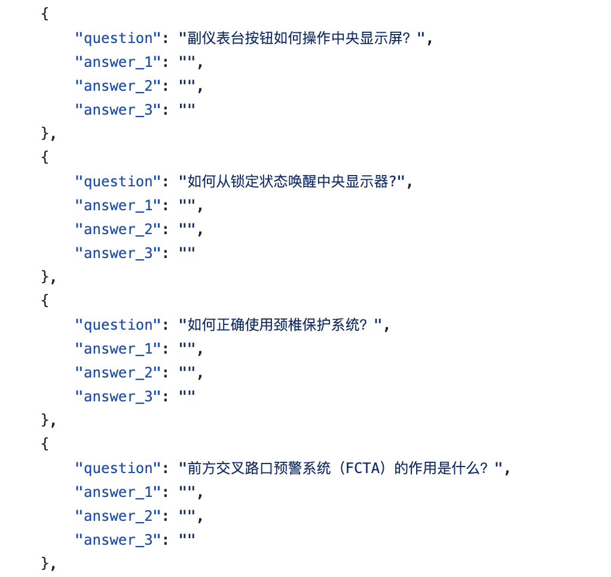
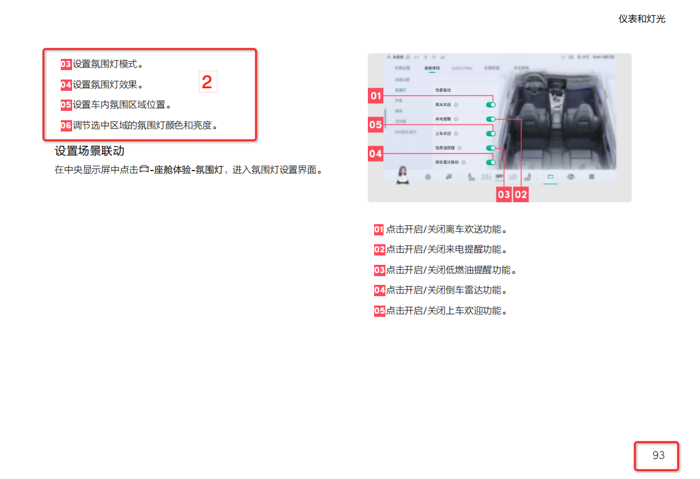

# 阶段14：项目实战1：智能座舱汽车知识大脑

该项目属于最近很火的大模型RAG任务，使用现有的车主手册构建知识库，然后选择知识库中的相关知识用于辅助大模型生成。整个方案的构建流程主要分为3大部分：构建知识库、知识检索、答案生成。

### 1、代码结构

```text
.
├── Dockerfile                     # 镜像文件
├── README.md                      # 说明文档
├── bm25_retriever.py              # BM25召回
├── build.sh                       # 镜像编译打包
├── data                           # 数据目录
│   ├── result.json                # 结果提交文件
│   ├── test_question.json         # 测试集
│   └── train_a.pdf                # 训练集
├── faiss_retriever.py             # faiss向量召回
├── vllm_model.py                  # vllm大模型加速wrapper
├── pdf_parse.py                   # pdf文档解析器
├── pre_train_model                # 预训练大模型
│   ├── Qwen-7B-Chat               # Qwen-7B
│   │   └── download.py
│   ├── bge-reranker-large         # bge重排序模型
│   └── m3e-large                  # 向量检索模型
├── qwen_generation_utils.py       # qwen答案生成的工具函数
├── requirements.txt               # 此项目的第三方依赖库
├── rerank_model.py                # 重排序逻辑
├── run.py                         # 主文件                         
└── run.sh                         # 主运行脚本             
```

### 2 、项目概述

#### 2.1 基于大模型的文档检索问答

任务：项目要求以大模型为中心制作一个问答系统，回答用户的汽车相关问题。需要根据问题，在文档中定位相关信息的位置，并根据文档内容通过大模型生成相应的答案。本项目涉及的问题主要围绕汽车使用、维修、保养等方面，具体可参考下面的例子：

问题1：怎么打开危险警告灯？
答案1：危险警告灯开关在方向盘下方，按下开关即可打开危险警告灯。

问题2：车辆如何保养？
答案2：为了保持车辆处于最佳状态，建议您定期关注车辆状态，包括定期保养、洗车、内部清洁、外部清洁、轮胎的保养、低压蓄电池的保养等。

问题3：靠背太热怎么办？
答案3：您好，如果您的座椅靠背太热，可以尝试关闭座椅加热功能。在多媒体显示屏上依次点击空调开启按键→座椅→加热，在该界面下可以关闭座椅加热。


#### 2.2 数据集

训练数据（领克汽车的用户手册）：


测试集问题：


### 3、解决方案

#### 3.1 pdf解析

##### 3.1.1 pdf分块解析



如图所示，我们希望pdf解析能尽可能的按照快状进行解析，每一块当做一个样本，这样能尽可能的保证pdf中文本内容的完整性。

##### 3.1.2 pdf 滑窗法解析




如图1,2 所示，我们可以看到图1和图2上下文是连续的，如何保证文本内容的跨页连续性问题，我们提出滑窗法。

具体的把pdf中所有内容当做一个字符串来处理，按照句号进行分割，根据分割后的数组进行滑窗。具体的如下所示:

["aa","bb","cc","dd"]

如果字符串长度为4, 经过滑窗后的结果如下:

aabb

bbcc

ccdd

我们希望滑窗法像卷积一样可以不同的kernel,Stride,来寻找能覆盖到的最优的样本召回。

简单来说就是，滑动窗口是有overlap的，交叠这进行，这样可以最大限度保证文档块的完整性，避免把重要的答案步骤切碎或跳过。


**3.1.3 项目采取的pdf解析方案**

项目最终采用了三种解析方案的综合：

- pdf分块解析，尽量保证一个小标题+对应文档在一个文档块，其中文档块的长度分别是512和1024。
- pdf滑窗法解析，把文档句号分割，然后构建滑动窗口，其中文档块的长度分别是256和512。
- pdf非滑窗法解析，把文档句号分割，然后按照文档块预设尺寸均匀切分，其中文档块的长度分别是256和512。

按照3中解析方案对数据处理之后，然后对文档块做了一个去重，最后把这些文档块输入给召回模块。


#### 3.2 召回

召回主要使用langchain中的retrievers进行文本的召回。我们知道向量召回和bm25召回具有互补性，前者是深度语义召回，侧重泛化性，后者是字面召回，侧重关键词/实体的字面相关性，这两个召回算法也是工业界用的比较多的，比较有代表性，因此选用了这两个进行召回。


##### 3.2.1 向量召回

向量召回利用 FAISS 进行索引创建和查找，embedding 利用 [M3E-large](https://modelscope.cn/models/Jerry0/M3E-large/summary) 。

M3E 是 Moka Massive Mixed Embedding 的缩写

- Moka，此模型由 MokaAI 训练，开源和评测，训练脚本使用 [uniem](https://link.zhihu.com/?target=https://github.com/wangyuxinwhy/uniem/blob/main/scripts/train_m3e.py) ，评测 BenchMark 使用 [MTEB-zh](https://link.zhihu.com/?target=https://github.com/wangyuxinwhy/uniem/tree/main/mteb-zh)
- Massive，此模型通过千万级 (2200w+) 的中文句对数据集进行训练
- Mixed，此模型支持中英双语的同质文本相似度计算，异质文本检索等功能，未来还会支持代码检索
- Embedding，此模型是文本嵌入模型，可以将自然语言转换成稠密的向量

M3E共有以下三种模型：small, base, large。本项目采用的是M3E large。


##### 3.2.2 BM25召回

**BM25算法**，通常用于计算两个文本，或者文本与文档之间的相关性。所以可以用于文本相似度计算和文本检索等应用场景。它的主要思想是:对于文本query中的每个词qi，计算qi与候选文本(文档)的相关度，然后对所有词qi得到的相关度进行加权求和，从而得到query与文档document的相关性得分。

BM25召回利用 LangChain的BM25 Retrievers。


#### 3.3 重排序

Reranker 是信息检索生态系统中的一个重要组成部分，用于评估搜索结果，并进行重新排序，从而提升查询结果相关性。在 RAG 应用中，主要在拿到召回结果后使用 Reranker，能够更有效地确定文档和查询之间的语义相关性，更精细地对结果重排，最终提高搜索质量。

将 Reranker 整合到 RAG 应用中可以显著提高生成答案的精确度，因为 Reranker 能够在单路或多路的召回结果中挑选出和问题最接近的文档。此外，扩大检索结果的丰富度（例如多路召回）配合精细化筛选最相关结果（Reranker）还能进一步提升最终结果质量。使用 Reranker 可以排除掉第一层召回中和问题关系不大的内容，将输入给大模型的上下文范围进一步缩小到最相关的一小部分文档中。通过缩短上下文， LLM 能够更“关注”上下文中的所有内容，避免忽略重点内容，还能节省推理成本。

向量召回中使用的是bi-encoder结构，而bge-reranker-large 使用的是 cross-encoder结构，cross-encoder结构一定程度上要优于bi-encoder


上图为增加了 Reranker 的 RAG 应用架构。可以看出，这个检索系统包含两个阶段：

在向量数据库中检索出 Top-K 相关文档，同时也可以配合 Sparse embedding（稀疏向量模型，例如TF-DF）覆盖全文检索能力。

Reranker 根据这些检索出来的文档与查询的相关性进行打分和重排。重排后挑选最靠前的结果作为 Prompt 中的Context 传入 LLM，最终生成质量更高、相关性更强的答案。

但是需要注意，相比于只进行向量检索的基础架构的 RAG，增加 Reranker 也会带来一些挑战，增加使用成本。

这个成本包括两方面，增加延迟对于业务的影响、增加计算量对服务成本的增加。我们建议根据自己的业务需求，在检索质量、搜索延迟、使用成本之间进行权衡，合理评估是否需要使用 Reranker。


##### 3.3.1 cross-encoder

重排序此处使用了 [bge-reranker-large](https://modelscope.cn/models/Xorbits/bge-reranker-large/files)。

目前rerank模型里面，最好的应该是cohere，不过它是收费的。开源的是智源发布的bge-reranker-base和bge-reranker-large。bge-reranker-large的能力基本上接近cohere，而且在一些方面还更好；
几乎所有的Embeddings都在重排之后显示出更高的命中率和MRR，所以rerank的效果是非常显著的；

embedding模型和rerank模型的组合也会有影响，需要开发者在实际过程中去调测最佳组合。


#### 3.4 推理优化

##### 3.4 vLLM产品级加速


vLLM是一个基于Python的LLM推理和服务框架，它的主要优势在于简单易用和性能高效。通过PagedAttention技术、连续批处理、CUDA核心优化以及分布式推理支持，vLLM能够显著提高LLM的推理速度，降低显存占用，更好地满足实际应用需求。vLLM 推理框架使大模型推理速度得到明显提升，推理速度比普通推理有1倍的加速。在产品级的部署上，vLLM既能满足batch推理的要求，又能实现高并发下的continuous batching，在实际产品部署中应用是非常广泛的。

这里对Qwen-8B模型进行了vLLM加速，项目代码对该加速逻辑做了一个封装，具体可以参见：vllm_model.py。


